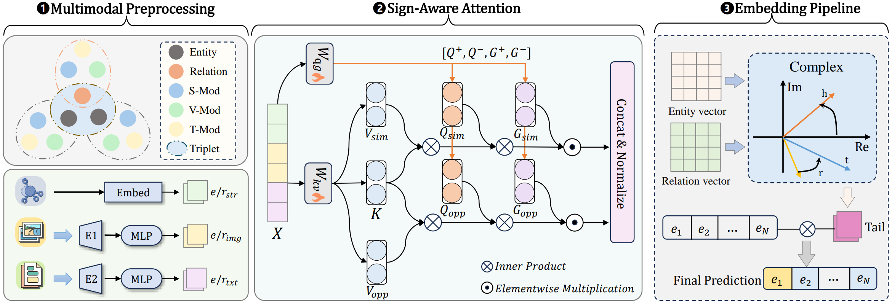

<h1 align="center">
  SiMT
</h1>

<h4 align="center">SiMT: Sign-aware Transformer for Multimodal Knowledge Graph Completion</h4>

<h2 align="center">
  Overview of SiMT
  
</h2>


This paper has been submitted to the ICASSP 2026.

### Dependencies

- python            3.10.13
- torch             2.1.1+cu118
- numpy             1.26.3
- transformers      4.44.1

### Dataset:

- We use WN18RR++, VTKG-I, and VTKG-C dataset for knowledge graph link prediction. 
- All the preprocessed data are included in the `./data` directory.

### Results:
The results are:

| Dataset  |  MRR  |  H@1  |  H@3  | H@10  |
| :------: | :---: | :---: | :---: | :---: |
| WN18RR++ | 0.559 | 0.496 | 0.586 | 0.680 |
|  VTKG-I  | 0.482 | 0.401 | 0.511 | 0.664 |
|  VTKG-C  | 0.478 | 0.399 | 0.510 | 0.601 |

## How to Run
```
python train.py  --data WN18RR++ --lr 0.001 --dim 256 --num_epoch 750 --valid_epoch 50 --exp best     --num_layer_enc_ent 2 --num_layer_enc_rel 1 --num_layer_dec 1      --num_head 16 --hidden_dim 2048 --dropout 0.1    --emb_dropout 0.9 --vis_dropout 0.3 --txt_dropout 0.1    --smoothing 0.0 --batch_size 1024 --decay 0.0 --max_img_num 1 --step_size 50               ## WN18RR++

python train.py  --data VTKG-I --lr 0.001 --dim 32 --num_epoch 150 --valid_epoch 50 --exp best     --num_layer_enc_ent 1 --num_layer_enc_rel 1 --num_layer_dec 1      --num_head 4 --hidden_dim 1024 --dropout 0.1    --emb_dropout 0.8 --vis_dropout 0.3 --txt_dropout 0.1    --smoothing 0.0 --batch_size 512 --decay 0.0 --max_img_num 3 --step_size 50           ## VTKG-I

python train.py   --data VTKG-C --lr 0.001 --dim 256 --num_epoch 350 --valid_epoch 50 --exp best     --num_layer_enc_ent 2 --num_layer_enc_rel 1 --num_layer_dec 1      --num_head 4 --hidden_dim 2048 --dropout 0.1    --emb_dropout 0.9 --vis_dropout 0.3 --txt_dropout 0.1    --smoothing 0.0 --batch_size 512 --decay 0.0 --max_img_num 3 --step_size 50            ## VTKG-C
```

